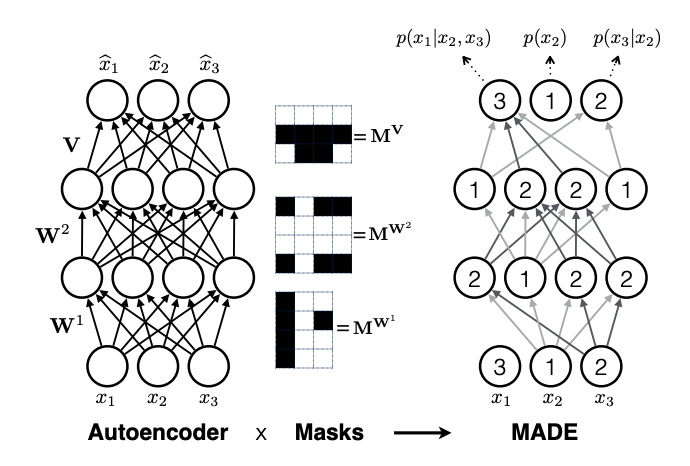
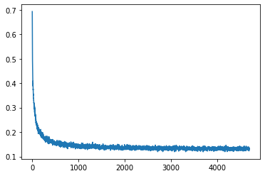
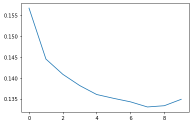
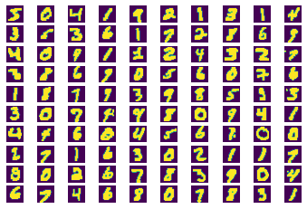
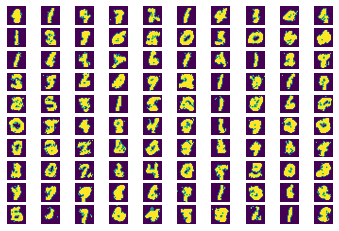

# MADE_pytorch

## Source Paper

This code is the implementation of paper - 

**MADE: Masked Autoencoder for Distribution Estimation** 

[Link to Paper](https://arxiv.org/pdf/1502.03509)

---

## References : 

Code is inspired from - https://github.com/karpathy/pytorch-made

--- 

## Training Data

MNIST Dataset is used for training. Pixel values are converted to binary values before training. Image size is reduced to 20 x 20 to reduce model complexity.

--- 

## Network Details

MADE defines implicit joint input image probability using the chain rule. The linear connections between layers is adjusted (masked) in a way so that each output probability is the conditional probability distribution based on all previously sampled pixel values. 

For binary pixel value case, sampling happens assuming the bernoulli distribution. 

----
## Training Loss 

Training loss is plotted after each iteration on batch of 128 images. 

----
## Validation Loss 

Validation loss is calculated on the valid data after each epoch.

--- 

## MNIST Images (Original)

---

## MNIST Images (Generated)

---
